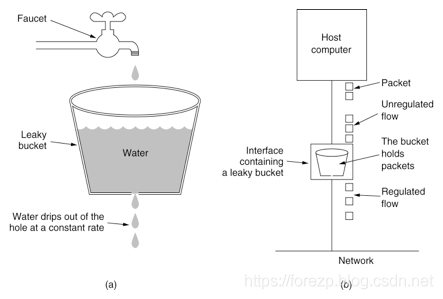

# Spring Cloud Gateway

## Overview
This project provides a library for building an API Gateway on top of Spring MVC. Spring Cloud Gateway aims to provide a simple, yet effective way to route to APIs and provide cross cutting concerns to them such as: security, monitoring/metrics, and resiliency.

## Features
Spring Cloud Gateway features:

- Built on Spring Framework 5, Project Reactor and Spring Boot 2.0
- Able to match routes on any request attribute.
- Predicates and filters are specific to routes.
- Hystrix Circuit Breaker integration.
- Spring Cloud DiscoveryClient integration
- Easy to write Predicates and Filters
- Request Rate Limiting
- Path Rewriting

## Getting Started

```java
@SpringBootApplication
public class DemogatewayApplication {
	@Bean
	public RouteLocator customRouteLocator(RouteLocatorBuilder builder) {
		return builder.routes()
			.route("path_route", r -> r.path("/get")
				.uri("http://httpbin.org"))
			.route("host_route", r -> r.host("*.myhost.org")
				.uri("http://httpbin.org"))
			.route("rewrite_route", r -> r.host("*.rewrite.org")
				.filters(f -> f.rewritePath("/foo/(?<segment>.*)", "/${segment}"))
				.uri("http://httpbin.org"))
			.route("hystrix_route", r -> r.host("*.hystrix.org")
				.filters(f -> f.hystrix(c -> c.setName("slowcmd")))
				.uri("http://httpbin.org"))
			.route("hystrix_fallback_route", r -> r.host("*.hystrixfallback.org")
				.filters(f -> f.hystrix(c -> c.setName("slowcmd").setFallbackUri("forward:/hystrixfallback")))
				.uri("http://httpbin.org"))
			.route("limit_route", r -> r
				.host("*.limited.org").and().path("/anything/**")
				.filters(f -> f.requestRateLimiter(c -> c.setRateLimiter(redisRateLimiter())))
				.uri("http://httpbin.org"))
			.build();
	}
}
```

> 以上gateway的描述来源于官网描述，地址：https://spring.io/projects/spring-cloud-gateway#overview

## Gateway服务注册与发现
与Nacos集成，POM中添加如下依赖：
```xml
    <dependency>
        <groupId>org.springframework.cloud</groupId>
        <artifactId>spring-cloud-starter-alibaba-nacos-discovery</artifactId>
    </dependency>

```
配置如下：
```yaml
server:
  port: 8001
spring:
  application:
    name: nacos-getway
  cloud:
    nacos:
      discovery:
        server-addr: localhost:8848
    gateway:
      discovery:
        locator:
          enabled: true
          lower-case-service-id: true
      routes:
      - id: nacos-getway-provider
        uri: lb://nacos-provider
        predicates:
        - Path=/provider/**
      - id: nacos-getway-consumer
        uri: lb://nacos-consumer
        predicates:
        - Path=/**
```
各字段含义如下：
```text
各字段含义如下：

id：我们自定义的路由 ID，保持唯一
uri：目标服务地址,以lb://开头（lb代表从注册中心获取服务）
predicates：路由条件，Predicate 接受一个输入参数，返回一个布尔值结果。
该接口包含多种默认方法来将 Predicate 组合成其他复杂的逻辑（比如：与，或，非）。
filters：过滤规则，本示例暂时没用。
```

## Gateway限流
常见的限流方式，比如Hystrix适用线程池隔离，超过线程池的负载，走熔断的逻辑。在一般应用服务器中，比如tomcat容器也是通过限制它的线程数来控制并发的；也有通过时间窗口的平均速度来控制流量。常见的限流纬度有比如通过Ip来限流、通过uri来限流、通过用户访问频次来限流。

一般限流都是在网关这一层做，比如Nginx、Openresty、kong、zuul、Spring Cloud Gateway等；也可以在应用层通过Aop这种方式去做限流。

### 常见的限流算法

- 计数器算法

> 计数器算法采用计数器实现限流有点简单粗暴，一般我们会限制一秒钟的能够通过的请求数，比如限流qps为100，算法的实现思路就是从第一个请求进来开始计时，在接下去的1s内，每来一个请求，就把计数加1，如果累加的数字达到了100，那么后续的请求就会被全部拒绝。等到1s结束后，把计数恢复成0，重新开始计数。具体的实现可以是这样的：对于每次服务调用，可以通过AtomicLong#incrementAndGet()方法来给计数器加1并返回最新值，通过这个最新值和阈值进行比较。这种实现方式，相信大家都知道有一个弊端：如果我在单位时间1s内的前10ms，已经通过了100个请求，那后面的990ms，只能眼巴巴的把请求拒绝，我们把这种现象称为“突刺现象”
>
> 
>
> 在算法实现方面，可以准备一个队列，用来保存请求，另外通过一个线程池（ScheduledExecutorService）来定期从队列中获取请求并执行，可以一次性获取多个并发执行。
>
> 这种算法，在使用过后也存在弊端：无法应对短时间的突发流量。

- 漏桶算法

> 漏桶算法为了消除"突刺现象"，可以采用漏桶算法实现限流，漏桶算法这个名字就很形象，算法内部有一个容器，类似生活用到的漏斗，当请求进来时，相当于水倒入漏斗，然后从下端小口慢慢匀速的流出。不管上面流量多大，下面流出的速度始终保持不变。不管服务调用方多么不稳定，通过漏桶算法进行限流，每10毫秒处理一次请求。因为处理的速度是固定的，请求进来的速度是未知的，可能突然进来很多请求，没来得及处理的请求就先放在桶里，既然是个桶，肯定是有容量上限，如果桶满了，那么新进来的请求就丢弃。

- 令牌桶算法

> 从某种意义上讲，令牌桶算法是对漏桶算法的一种改进，桶算法能够限制请求调用的速率，而令牌桶算法能够在限制调用的平均速率的同时还允许一定程度的突发调用。在令牌桶算法中，存在一个桶，用来存放固定数量的令牌。算法中存在一种机制，以一定的速率往桶中放令牌。每次请求调用需要先获取令牌，只有拿到令牌，才有机会继续执行，否则选择选择等待可用的令牌、或者直接拒绝。放令牌这个动作是持续不断的进行，如果桶中令牌数达到上限，就丢弃令牌，所以就存在这种情况，桶中一直有大量的可用令牌，这时进来的请求就可以直接拿到令牌执行，比如设置qps为100，那么限流器初始化完成一秒后，桶中就已经有100个令牌了，这时服务还没完全启动好，等启动完成对外提供服务时，该限流器可以抵挡瞬时的100个请求。所以，只有桶中没有令牌时，请求才会进行等待，最后相当于以一定的速率执行。
>
> 
>
> 实现思路：可以准备一个队列，用来保存令牌，另外通过一个线程池定期生成令牌放到队列中，每来一个请求，就从队列中获取一个令牌，并继续执行。


在Spring Cloud Gateway中，有Filter过滤器，因此可以在“pre”类型的Filter中自行实现上述三种过滤器。但是限流作为网关最基本的功能，Spring Cloud Gateway官方就提供了RequestRateLimiterGatewayFilterFactory这个类，适用Redis和lua脚本实现了令牌桶的方式，具体实现逻辑在RequestRateLimiterGatewayFilterFactory类中。

工程的pom文件中引入gateway的起步依赖和redis的reactive依赖，如下：

```xml
     <dependency>
        <groupId>org.springframework.cloud</groupId>
        <artifactId>spring-cloud-starter-gateway</artifactId>
    </dependency>
    
    <dependency>
        <groupId>org.springframework.boot</groupId>
        <artifatId>spring-boot-starter-data-redis-reactive</artifactId>
    </dependency>
```
配置如下：
```yaml
server:
  port: 8081
spring:
  cloud:
    gateway:
      routes:
      - id: limit_route
        uri: http://httpbin.org:80/get
        predicates:
        - After=2017-01-20T17:42:47.789-07:00[America/Denver]
        filters:
        - name: RequestRateLimiter
          args:
            key-resolver: '#{@hostAddrKeyResolver}'
            redis-rate-limiter.replenishRate: 1
            redis-rate-limiter.burstCapacity: 3
  application:
    name: gateway-limiter
  redis:
    host: localhost
    port: 6379
    database: 0
```
在上面的配置文件，指定程序的端口为8081，配置了 redis的信息，并配置了RequestRateLimiter的限流过滤器，该过滤器需要配置三个参数：

- burstCapacity，令牌桶总容量。
- replenishRate，令牌桶每秒填充平均速率。
- key-resolver，用于限流的键的解析器的 Bean 对象的名字。它使用 SpEL 表达式根据#{@beanName}从 Spring 容器中获取 Bean 对象。

KeyResolver需要实现resolve方法，比如根据Hostname进行限流，则需要用hostAddress去判断。实现完KeyResolver之后，需要将这个类的Bean注册到Ioc容器中。

```java
public class HostAddrKeyResolver implements KeyResolver {

    @Override
    public Mono<String> resolve(ServerWebExchange exchange) {
        return Mono.just(exchange.getRequest().getRemoteAddress().getAddress().getHostAddress());
    }

}

@Bean
public HostAddrKeyResolver hostAddrKeyResolver() {
    return new HostAddrKeyResolver();
}

```

可以根据uri去限流，这时KeyResolver代码如下：

```java
public class UriKeyResolver  implements KeyResolver {

    @Override
    public Mono<String> resolve(ServerWebExchange exchange) {
        return Mono.just(exchange.getRequest().getURI().getPath());
    }

}

 @Bean
    public UriKeyResolver uriKeyResolver() {
        return new UriKeyResolver();
    }

```

也可以以用户的维度去限流：

```java
  @Bean
    KeyResolver userKeyResolver() {
        return exchange -> Mono.just(exchange.getRequest().getQueryParams().getFirst("user"));
    }

```


## 工程说明
由于此Maven工程又有自己的父工程，所有通过一下方式来解决SpringBoot的父依赖问题：
```xml
	<dependencyManagement>
		<dependencies>
			<dependency>
				<groupId>org.springframework.cloud</groupId>
				<artifactId>spring-cloud-dependencies</artifactId>
				<version>${spring-cloud.version}</version>
				<type>pom</type>
				<scope>import</scope>
			</dependency>
			<dependency>
				<groupId>org.springframework.boot</groupId>
				<artifactId>spring-boot-dependencies</artifactId>
				<version>2.2.10.RELEASE</version>
				<type>pom</type>
				<scope>import</scope>
			</dependency>
			<dependency>
				<groupId>org.springframework.cloud</groupId>
				<artifactId>spring-cloud-alibaba-dependencies</artifactId>
				<version>${spring-cloud-alibaba-dependencies.version}</version>
				<type>pom</type>
				<scope>import</scope>
			</dependency>

		</dependencies>
	</dependencyManagement>
```

这样可以实现多个pom的引入

```java
List<String> words = Arrays.asList("th", "qu");
Flux<String> manyLetters = Flux
        .fromIterable(words)
        .flatMap(word -> {
            System.out.println("Step1=" + word);
            return Flux.fromArray(word.split(""));})
        .filter(s -> {
            System.out.println("Step2=" + s);
            return true;
        }).filter(s -> {
            System.out.println("Step3=" + s);
            return true;
        });
manyLetters.subscribe(s -> System.out.println("Result=" + s + "\n"));
```